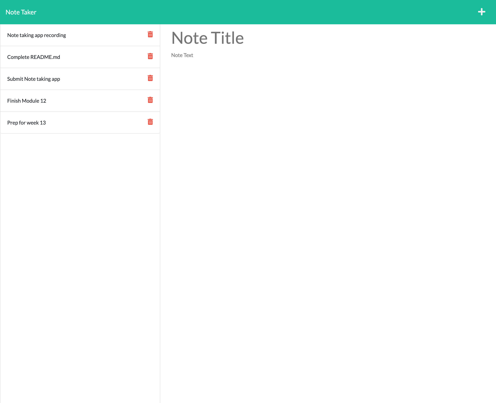

# Note Taker

## Table of Contents
 * [Description](#Description)
 * [Installation](#Installation)
 * [Usage](#Usage)
 * [Contribution](#Contribution)
 * [Tests](#Tests)
 * [License](#License)
 * [Questions](#Questions)

## Description
Note Taker is a applicatin develop so that you a user can make and keep notes of their task or thoughs. The application uses a express.js as a its backend server to POST and DELETE notes and slo rendering the HTML pages. The page is deployed using Heroku and can be accessed at https://mysterious-shore-49467.herokuapp.com/

## Built With
 * JavaScript
 * HTML
 * CSS
 * Bootstrap
 * Node
 * Express.js
 * Heroku
 * Jest
 
## ScreenShot

## Installation
To install Note Taker, go to https://github.com/omcewan/mcewans-notetaking-app and download the code base to your local system. You will need to have Node.js installed. Once Node is installed, in Develop directory from the command line you will type npm install. This will download all the required dependecies for the application. Once completed the server can be started using "npm start". At this point the application is functioning on the localhost and is installed correctly.

## Usage
To use Note Taker sipmly naviagate to the application website mentioned in the description. Then to get started click on the "Get Started" button, this will direct you to the page where you can enter notes. Simply enter a title and text and a save icon will appear on the top right hand side where you can hit to save your note which will appear on the left with all other previously created notes. You can click on a previous note to see its details or hit the delete simple to remove the note. Clicking on the plus sign on the top right hand will prompt a new note section to be available so you can add a new note.

## Contribution
to contribute to the application please fork the repo and then after adding any features or bug fixes please do a pull request so that you changes can be approved.

## Tests
Jest was used to write test for the functions used for the POST, DELETE and VERIFICATION of notes added to the application. The tests can be found in the __test__ directory in the repo.

## License
This application is covered under the MIT.
For more details about licensing, use this link: https://choosealicense.com/licenses/mit/.

## Questions
For additional information about the project, please find it at the following www.github.com/omcewan.
Also if you have additional questions please contact me at orlandomcewan231@gmail.com.
